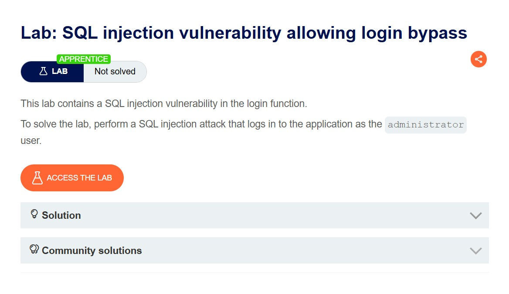
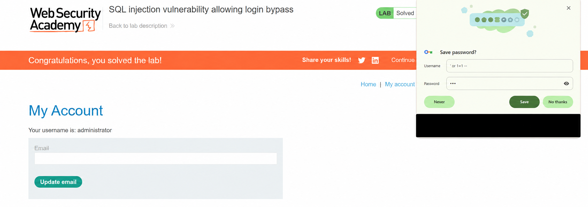

# Lab 002 — Injection SQL : contournement de connexion

[← Retour à l'index](../README.md)

| Élément | Détail |
| --- | --- |
| Plateforme | PortSwigger Web Security Academy |
| Lab | SQL injection vulnerability allowing login bypass |
| Niveau | Apprentice |
| Vulnérabilité | Injection SQL dans la fonction de connexion |
| Point d'entrée | Champ de nom d'utilisateur |
| Outil visible | Navigateur web |
| Résultat | **Solved**, session du compte `administrator` visible |

## Objectif

Accéder au compte `administrator` en exploitant la fonction de connexion. L'objectif est confirmé par [l'énoncé officiel](https://portswigger.net/web-security/sql-injection/lab-login-bypass) et la capture ci-dessous.

## 1. Lire l'énoncé

La page identifie une injection SQL dans l'authentification et présente le lab comme **Not solved**.



## 2. Repérer l'accès au compte

La boutique présente un lien **My account** en haut à droite, qui permet d'accéder à la fonction de connexion. La capture montre le catalogue ; le formulaire de connexion n'est pas fourni dans les images.


## 3. Identifier le payload utilisé

La fenêtre d'enregistrement du navigateur, visible sur la capture finale, présente cette valeur comme nom d'utilisateur :

```text
' or 1=1 --
```

Le mot de passe est masqué. Sa valeur exacte et la requête HTTP ne sont pas visibles ; aucun usage d'un proxy n'est affirmé.

## 4. Comprendre le contournement

La requête suivante est un modèle pédagogique illustrant une authentification vulnérable. Le code serveur et les noms de tables ne sont pas observés dans les captures.

```sql
SELECT * FROM users
WHERE username = '<username>' AND password = '<password>'
```

Avec le payload observé, ce modèle devient :

```sql
SELECT * FROM users
WHERE username = '' or 1=1 --' AND password = '<password>'
```

L'apostrophe ferme la chaîne. `or 1=1` rend la condition vraie. Le commentaire `--` neutralise la vérification du mot de passe dans ce contexte.

Cette forme peut retourner plusieurs utilisateurs. Le compte choisi dépend ensuite de la logique de l'application et de l'ordre des résultats : elle ne garantit pas l'accès à `administrator` dans toutes les applications. Dans cette instance, la capture confirme que la session obtenue appartient bien à ce compte.

## 5. Vérifier la réussite

La page **My Account** affiche `Your username is: administrator`, le statut vert **Solved** et une bannière de réussite.



*Cette copie a été retouchée pour masquer le pied de la fenêtre du gestionnaire de mots de passe contenant une adresse e-mail personnelle. Les éléments de validation ont été contrôlés visuellement par comparaison avec l'original. Les captures originales restent dans le dossier source local.*

## Impact et correction

L'impact démontré est un contournement d'authentification avec accès au compte administrateur du lab. Les captures ne montrent pas d'extraction d'autres données ni de modification de compte.

Pour corriger cette classe de vulnérabilité, rechercher l'utilisateur avec une requête paramétrée, puis vérifier le mot de passe à l'aide d'une fonction adaptée aux mots de passe hachés. Les entrées doivent rester des données et ne jamais être concaténées au SQL.

```sql
SELECT id, username, password_hash FROM users WHERE username = ?
```

Le marqueur dépend du pilote de base de données. L'application doit vérifier le mot de passe avant de créer la session, puis appliquer les contrôles d'autorisation sur chaque action protégée.

## Ce que je retiens

Une injection SQL dans le champ de connexion peut supprimer la vérification du mot de passe. Une condition toujours vraie explique le contournement, mais le compte obtenu doit être vérifié dans la session : ici, les captures confirment `administrator`.

## Référence

[PortSwigger — énoncé et solution du lab](https://portswigger.net/web-security/sql-injection/lab-login-bypass).
