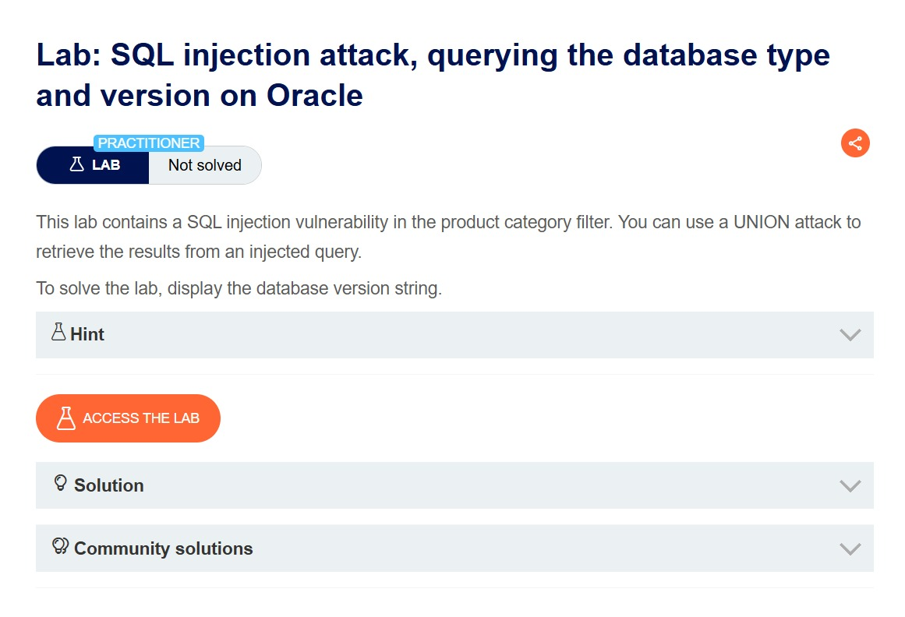
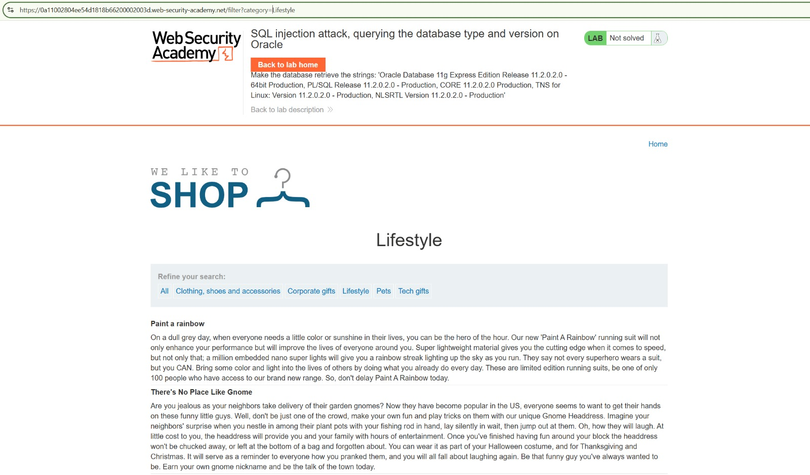
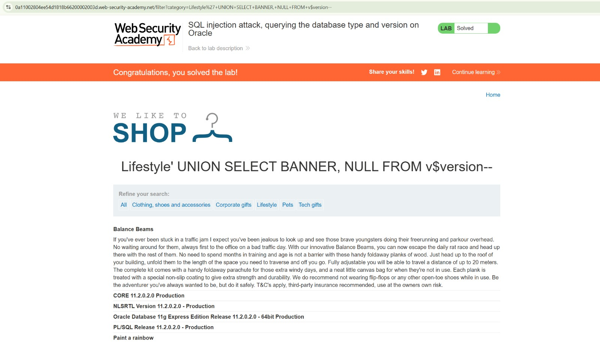

# Lab 003 — Injection SQL : identifier la version d'Oracle

[← Retour à l'index](../README.md)

| Élément | Détail |
| --- | --- |
| Plateforme | PortSwigger Web Security Academy |
| Lab | SQL injection attack, querying the database type and version on Oracle |
| Niveau | Practitioner |
| Vulnérabilité | Injection SQL avec UNION dans le filtre de catégorie |
| Point d'entrée | Paramètre GET `category`, route `/filter` |
| Outil visible | Navigateur web |
| Résultat | **Solved**, version Oracle affichée |

## Objectif

Afficher la version de la base de données à travers le filtre de produits vulnérable. Le scénario permet une attaque `UNION` dont les résultats apparaissent dans la page, comme indiqué dans [l'énoncé officiel](https://portswigger.net/web-security/sql-injection/examining-the-database/lab-querying-database-version-oracle).

## 1. Lire l'énoncé

La première capture présente le lab et son statut **Not solved**. L'objectif est d'obtenir la chaîne de version de la base Oracle.



## 2. Observer le filtre de catégorie

La catégorie **Lifestyle** est sélectionnée. La barre d'adresse montre :

```text
/filter?category=Lifestyle
```

La page affiche les noms et descriptions des produits. Le bandeau décrit les chaînes de version attendues, mais le statut reste **Not solved** : ces indications ne constituent pas encore une extraction réussie.



## 3. Injecter une requête UNION

La capture finale montre cette valeur dans le filtre :

```text
Lifestyle' UNION SELECT BANNER, NULL FROM v$version--
```

Le chemin visible dans la barre d'adresse est :

```text
/filter?category=Lifestyle%27+UNION+SELECT+BANNER,+NULL+FROM+v$version--
```

L'apostrophe ferme la chaîne de catégorie. `UNION SELECT` ajoute les lignes de la requête injectée au résultat initial. `BANNER` fournit les chaînes de version de la vue Oracle `v$version`. `NULL` complète la seconde colonne et `--` commente la fin de la requête initiale dans ce lab.

Le succès du payload montre une compatibilité avec un résultat à deux colonnes et une première colonne acceptant du texte. Les captures ne montrent pas les tests préalables du nombre de colonnes ou des types ; ils ne sont donc pas présentés comme des étapes réalisées.

Pour préparer ce type d'attaque, la solution officielle propose un test avec deux chaînes et `FROM dual`. Cette table est utile pour sélectionner des constantes dans le contexte Oracle du lab. Ici, la requête finale utilise directement `FROM v$version`.

## 4. Comprendre la requête

Le modèle ci-dessous illustre l'effet de l'injection. Les noms de colonnes de produits et le code serveur ne sont pas observés dans les captures.

```sql
-- Modèle pédagogique avant injection
SELECT name, description FROM products WHERE category = 'Lifestyle';

-- Modèle pédagogique après injection
SELECT name, description FROM products WHERE category = 'Lifestyle'
UNION SELECT BANNER, NULL FROM v$version--'
```

`UNION` exige le même nombre de colonnes et des types compatibles dans les deux sélections. Les bannières s'affichent alors dans la zone normalement utilisée pour les noms de produits.

## 5. Vérifier le résultat

La page affiche notamment :

```text
CORE 11.2.0.2.0 Production
NLSRTL Version 11.2.0.2.0 - Production
Oracle Database 11g Express Edition Release 11.2.0.2.0 - 64bit Production
PL/SQL Release 11.2.0.2.0 - Production
```

Ces lignes sont visibles parmi les produits. Le statut **Solved** et la bannière de réussite confirment l'objectif atteint.



## Impact et correction

L'impact démontré est la divulgation du moteur, de l'édition et de la version de la base. Les captures ne démontrent pas l'accès à d'autres tables, la modification de données ou une exécution de commandes.

Le filtre doit utiliser une requête paramétrée : la valeur de catégorie est liée comme donnée, sans concaténation au SQL. Une liste de catégories autorisées peut compléter cette protection. Le compte de base de données doit disposer uniquement des permissions nécessaires ; masquer les messages d'erreur ne corrige pas l'injection.

## Ce que je retiens

Une injection `UNION` permet d'afficher des résultats étrangers à la requête initiale. Le nombre et les types des colonnes doivent être compatibles. Dans ce lab, `BANNER` et `v$version` permettent d'identifier Oracle 11g Express Edition, version `11.2.0.2.0`.

## Référence

[PortSwigger — énoncé et solution du lab Oracle](https://portswigger.net/web-security/sql-injection/examining-the-database/lab-querying-database-version-oracle).
