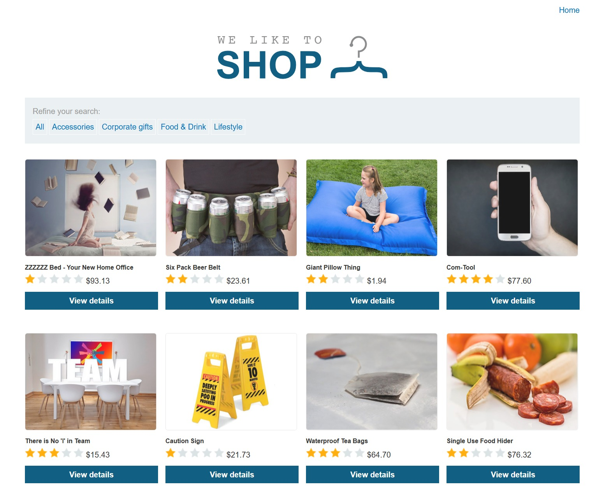
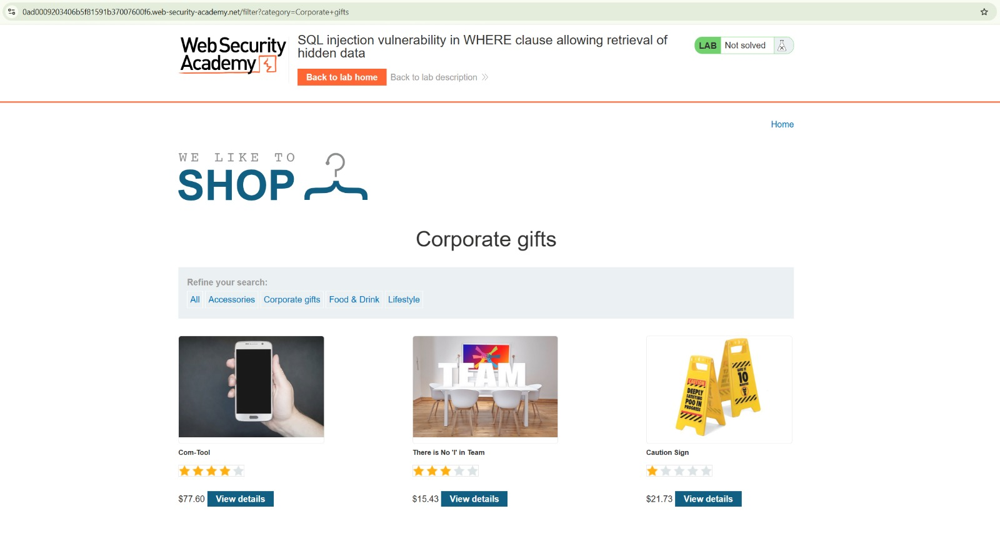
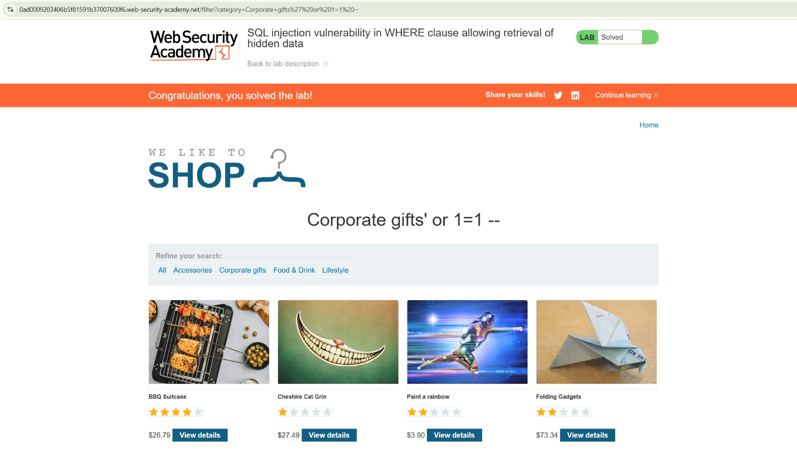

# Lab 01 — Injection SQL : récupération de données cachées

[← Retour à l'index](../../README.md)

| Élément | Détail |
| --- | --- |
| Plateforme | PortSwigger Web Security Academy |
| Lab | SQL injection vulnerability in WHERE clause allowing retrieval of hidden data |
| Vulnérabilité | Injection SQL dans un filtre de catégorie |
| Point d'entrée | Paramètre GET `category`, route `/filter` |
| Outil visible | Navigateur web |
| Résultat | **Solved**, confirmé par la dernière capture |

## Objectif

Faire apparaître des produits non publiés en modifiant le filtre de catégorie. Le scénario et le modèle de requête sont décrits dans [l'énoncé officiel](https://portswigger.net/web-security/sql-injection/lab-retrieve-hidden-data).

## 1. Observer le catalogue

La première capture montre la boutique et ses catégories. Le filtre de produits constitue le point d'entrée étudié dans ce lab.



## 2. Sélectionner une catégorie

La deuxième capture montre la catégorie **Corporate gifts** et trois produits visibles. L'adresse contient le chemin suivant :

```text
/filter?category=Corporate+gifts
```

Le statut du lab est encore **Not solved**. Le paramètre `category` transporte la valeur sélectionnée vers le serveur.



## 3. Modifier le paramètre

Dans la troisième capture, la catégorie contient le payload suivant :

```text
Corporate gifts' or 1=1 --
```

Le chemin visible, avec les espaces et l'apostrophe encodés, est :

```text
/filter?category=Corporate+gifts%27%20or%201=1%20--
```

La capture montre la valeur modifiée dans la barre d'adresse. Elle ne permet pas de déterminer si la modification a été saisie directement ou effectuée via un proxy ; aucun usage de Burp Suite n'est affirmé ici.

## 4. Comprendre le payload

Pour expliquer le résultat, on adapte le modèle de requête fourni par l'énoncé à la catégorie observée. Il s'agit d'une reconstruction pédagogique, pas d'une capture du code serveur.

Avant injection :

```sql
SELECT * FROM products
WHERE category = 'Corporate gifts' AND released = 1
```

Après insertion de la valeur :

```sql
SELECT * FROM products
WHERE category = 'Corporate gifts' or 1=1 --' AND released = 1
```

L'apostrophe ferme la chaîne de catégorie. `or 1=1` ajoute une condition toujours vraie. Le commentaire `--` neutralise la fin de la requête dans le contexte de ce lab, y compris la restriction `released = 1`. Des produits normalement masqués deviennent ainsi accessibles.

## 5. Vérifier le résultat

La dernière capture montre d'autres produits, le statut vert **Solved** et une bannière de réussite. Cette validation confirme que l'objectif du lab est atteint. Elle ne montre pas les valeurs internes du champ `released` pour chaque produit.



## Impact et correction

L'impact démontré est l'accès à des produits non publiés par contournement du filtre SQL. Les captures ne démontrent ni modification de données ni extraction d'autres tables.

La correction consiste à utiliser une requête paramétrée, afin que la catégorie reste une donnée :

```sql
SELECT * FROM products
WHERE category = ? AND released = 1
```

Le pilote de base de données doit lier la valeur au paramètre ; le marqueur exact dépend du pilote. Une liste de catégories autorisées peut compléter cette protection. Les permissions du compte de base de données doivent également être limitées au nécessaire.

## Ce que je retiens

Un simple filtre peut exposer une injection SQL si une entrée utilisateur est concaténée à la requête. Le payload combine une sortie de chaîne, une condition toujours vraie et un commentaire pour contourner une restriction métier. La validation de la plateforme fournit ici la preuve de réussite.

## Référence

[PortSwigger — énoncé et solution du lab](https://portswigger.net/web-security/sql-injection/lab-retrieve-hidden-data).
